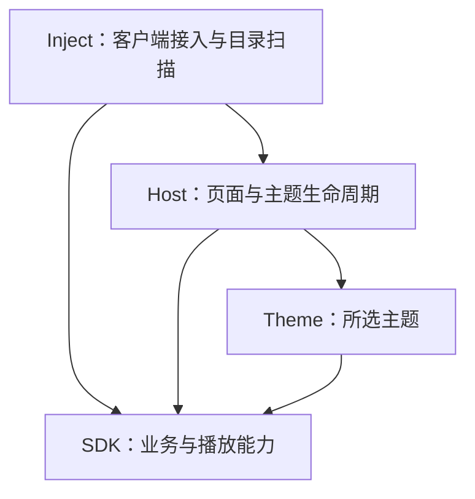

# 架构与依赖边界

EnhanceNCM 采用单仓库分层结构。各层独立存放，按职责构建；安装目录和运行时文件名保持兼容，不把源码目录直接复制给用户。

## Inject — src/inject

保留现有原生行为，负责 DLL 入口、CEF 接入、主题目录快照和独立 Chromatic 运行时。C++ 文件及导出定义集中在此目录，Visual Studio 工程保留根目录入口。

`EnhanceNCM.js` 是独立 QuickJS 脚本，不属于页面 SDK。页面 V8 和 Native QuickJS 不能直接共享 JavaScript 对象。原生层不实现歌曲列表、搜索页面或主题样式。

## 正在播放兼容服务

`src/sdk/domain/now-playing.js` 将共享播放会话的快照转换为 `now-playing-service` 使用的 `Track`、`Player`、`Progress` 和 `Lyric` 数据模型。它通过 CEF bridge 将序列化后的快照交给 `src/inject/now_playing_service.cpp`；页面侧不直接打开端口，也不把服务实现放进主题。

原生服务只监听 `127.0.0.1:9863`，按设置开关分别启用 HTTP/WebSocket API 和文件输出。HTTP API、歌词 WebSocket、封面转换及输出模板设置与 `now-playing-service` 保持兼容；`EnhanceNCM/Settings/settings.json` 持久化两个开关，`EnhanceNCM/Settings/settings-output.json` 持久化输出模板。文件输出由后台工作线程以临时文件替换方式更新，避免直播软件读取到半截内容。关闭文件输出会清理本次生成的安装目录 `EnhanceNCM/Outputs/title.txt`、`author.txt`、`cover.jpg` 和 `custom.txt`。

## SDK — src/sdk

- `startup.js`、`settings.js`：基础启动配置、存储与播放设置。
- `transport/`：客户端 Native 通道和请求传输适配。
- `domain/`：歌曲与歌单 API、账号缓存、音源、播放、会话、恢复、窗口及展示工具。
- `domain/music.js`：组合公开的 `EnhanceNCM.sdk` 接口。

SDK 不依赖主题注册器、页面挂载或某个主题。播放会话和队列由 SDK 管理，主题只订阅与操作会话。公开接口见 [SDK](SDK.md)。

## Host — src/host

`app.js` 提供桥接就绪等待与 ShadowRoot 挂载/卸载；`entry.js` 处理入口和启动恢复；`themes.js` 管理主题注册、选择与加载；`theme-host.js` 启动选中主题；`ui/` 保存原版设置与托盘界面。

宿主等待主题清理完成再切换，主题通过 `mount({root, sdk})` 获取根节点和能力。`EnhanceNCM.app`、`EnhanceNCM.ui`、`EnhanceNCM.themes` 是宿主接口，单独加载 SDK 不会挂载页面。

## Theme — src/themes

Spotify 的视图与交互位于 `spotify/standalone.js`，样式位于 `spotify/music-styles.js`。主题使用公开 SDK 获取快照、播放恢复、设置和封面配色，不直接访问对应私有对象或客户端通道。

主题与页面共享运行环境；模块边界是维护约定，不是权限沙箱。第三方主题接口与清理要求见 [主题开发](THEME_API.md)。

## 构建与依赖方向

`tools/build-page.js` 显式声明 SDK、Host 和 Spotify Theme 的模块顺序，分别生成三个脚本。SDK 首先加载，随后宿主加载并执行所选主题。新增模块需要加入相应清单。

`npm run check` 检查模块路径、重复与漏打包、语法，以及主题访问私有服务和 SDK 依赖宿主的常见违规。它是静态约束，不代替代码审查。

| 源码 | 构建产物 |
| --- | --- |
| `src/inject/*.cpp` | `build/msimg32.dll` |
| `src/inject/now_playing_service.cpp` | DLL 内的本机正在播放 HTTP/WebSocket 服务与 `EnhanceNCM/Outputs/` 输出 |
| `src/inject/EnhanceNCM.js` | `build/EnhanceNCM/EnhanceNCM.js` |
| `src/sdk/` | `build/EnhanceNCM/EnhanceNCM-sdk.js` |
| `src/host/` | `build/EnhanceNCM/EnhanceNCM-page.js` |
| `src/themes/spotify/` | `build/EnhanceNCM/Themes/Spotify/theme.js` |

`tests/` 中的单元测试验证 SDK 与宿主行为，浏览器测试通过模拟 Native 通道验证交互和异步竞争，原生测试验证目录扫描与 DLL 启动。GitHub CI 的覆盖范围、构建限制与发布命令见 [开发说明](DEVELOPMENT.md)。

Chromatic 的项目补丁保存在 `patches/chromatic/`，由 `npm run deps:patch` 检查和应用。详细启动、缓存、播放及生命周期行为保留在 [运行时实现说明](RUNTIME.md)。

## 本地文件入口

`src/sdk/domain/local-music.js` 负责路径规范化、Native 元数据及本地打开事件；`src/host/local-files.js` 在主题挂载前接收事件，挂载后交给 SDK 播放会话。播放层对本地歌曲使用 `type: 0` 文件源，在线歌曲继续使用授权 URL。持久化保留本地路径与元数据，主题通过公共接口识别本地歌曲。

## 本地封面的系统媒体同步

页面可直接显示 `orpheus://localmusic/pic`，但客户端任务栏与 SMTC 从 Native HTTP 图片缓存取图。SDK 将已加载的内嵌封面缩放为最长边 320 像素的 PNG，交给 Inject 层 `artwork_cache.cpp` 的内存缓存，再通过 `orpheus://cache?<缓存地址>` 预载；完成后任务栏和 SMTC 使用同一缓存地址。

内存缓存按内容 SHA-256 去重，最多 32 张、每张不超过 1 MiB，并验证 PNG 标识与尺寸。图片端点只监听随机的 IPv4 回环端口，路径包含随机令牌，仅支持读取，不接受上传或文件路径，进程退出即释放。音乐文件和内嵌标签不被修改。缓存 URL 仅用于当前系统媒体会话，不写入歌曲持久化数据。

暂停切换复用缓存地址；切歌时取消旧图的展示更新，旧异步完成不会覆盖新歌曲。无封面或封面读取失败时提交真正的默认图，而非重复提交失败地址。本地文件系统媒体封面功能需要配套更新 DLL 与 SDK。

## 长列表与启动时序

SQL 兼容读取先等待共享的 Native 存储初始化；系统媒体初始化等待窗口初始化完成，避免冷启动请求丢失。播放状态保存合并并发请求，失败后退避，重试会重新读取先前失败的恢复记录。Spotify 对超过 120 首的列表按可见区域渲染，滚动时保持完整列表高度，播放与搜索仍使用完整数据。
